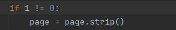
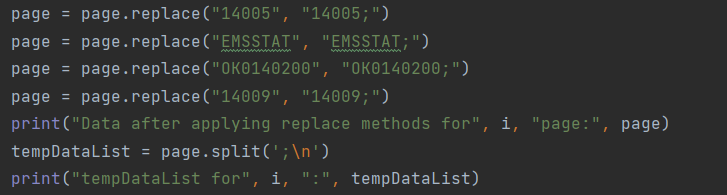
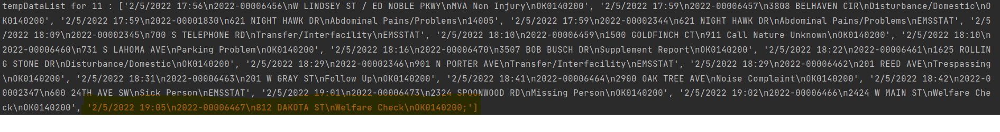
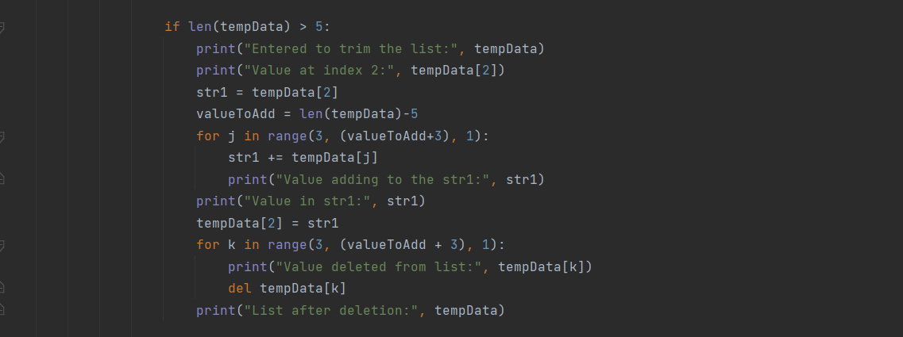
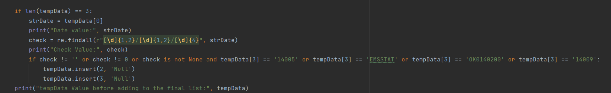
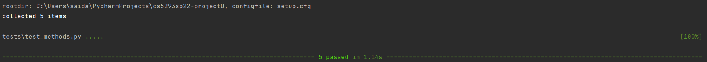

Goal: the aim of the project is to provide a summary of incident_nature and its respective count that happened in Norman on a particular date as output by taking in the URL as input from the user. This pdf file contains sensitive information like incident nature, location etc.

### EXAMPLE ON HOW TO RUN THE APPLICATION: 
#### steps:
1) First clone the project using : git clone <project-url>
2) check to see if there is a directory named as 'cs5293sp22-project0' using ls
3) open the directory  using cd cs5293sp22-project0
4) Run the below command to start the project:
pipenv run python project0/main.py --incidents https://www.normanok.gov/sites/default/files/documents/2022-02/2022-02-01_daily_incident_summary.pdf

### WEB OR EXTERNAL LIBRARIES:
* import argparse
* import PyPDF2
* import re
* import urllib.request
* import sqlite3

INSTALLATION OF ABOVE LIBRARIES:
* To install PyPDF2: pipenv install PyPDF2

Note: All the remaining above-mentioned libraries come as in-built modules for python3.

### Assumptions made in the project:
* These assumptions are made after analyzing numerous daily activity reports.
* The URL provided to the code should be active in the website: https://www.normanok.gov/public-safety/police-department/crime-prevention-data/department-activity-reports
* After observing various reports, I have found that 'Incident ORI' column consists of only four types of values i.e.; 14005, EMSSTAT, OK0140200, and 14009. 
* Column values in all rows are separated by '\n'. So, I have added a delimiter to all the values in the 'Incident ORI' column.
* Coming to missing/Empty values, I have assigned Null value to these fields. I have made an assumption after reviewing various files that empty values occur only in location and nature columns that too at the same time. So, when ever the length equals 3, I am adding Null values to the record.
* Multiline values: these only appear in location column. So, when these appear in a pdf file, I am combining/merging excess values to the second index in the record's list and deleting the excess values.
* The database file is created with the name 'normanpd.db'
* The incidents database is dropped first whenever you try to insert new pdf file data into the database.

### FUNCTIONS AND APPROACH TO DEVELOPING THE DATABASE:

main.py:

* This file acts as a base layer for my project where it takes the incidents URL which is of String type as input from the user and passes it to the main function as an input parameter.
* In the main function, we make function calls to three different class files named fetchIncidents.py, extractIncidents.py, and incidentsDB.py which contains methods that collect, extract, insert, and provide incident_nature, respective count to the user.
* At first, the URL which was collected from the user will be passed as an input parameter to the 'fetchincidents' function in the 'dataFetchedFromURL' class in the fetchIncidents.py file. This function returns data as output which will be acted as an input for another function.
* The result from the 'fetchincidents' function act as an input parameter to 'extractincidents' function in 'extractDataFromFile' class file in extractIncidents.py file. After the data is fetched and processed, it will send to 'populatedb' function in 'incidentDataBase' class in incidentsDB.py file to be inserted into the sqlite3 database.
* Before inserting the data, we make a function call to 'createdb' function to see if we can successfully connect to the database.
* Finally, we call the 'status' function in the 'incidentDataBase' class in the incidentsDB.py file to check the incident_nature and its respective count.

fetchIncidents.py:

* In this file, the 'fetchincidents' function receives the user-provided URL as an input and uses the urllib.request library to open the URL and returns the output as file-like objects. This library has urlopen function to perform this operation.
* The final result is returned to the main function and passed as an input to the 'extractincidents' function.

extractIncidents.py

* This file contains a function called 'extractincidents' which takes the result from 'fetchincidents' function.
* Firstly, it writes the data to a temporary file using the "import tempfile" module and sets the seek value to 0. So, python knows to read data from the start of the file.
* Using the' PyPDF2.pdf.PdfFileReader' module, we read the data from tempfile and store it in pdfReader variable which becomes an iterable file-like object.
* I have used for loop to iterate the pdfReader and to extract text in a page based on parameter i.
 

* Above if block was written for page 0 to replace String discripencies like 'NORMAN POLICE DEPARTMENT', 'Daily Incident Summary (Public)', 'Date / Time', 'Incident', 'Number', 'Location', 'Nature', and 'Incident ORI' with ''(empty space).
* Further to remove the empty spaces in a string, I have used the strip method.

output:
`Before applying replace method for page: 0
Page value Date / Time
Incident Number
Location
Nature
Incident ORI
2/5/2022 0:07
2022-00006333
520 BLUE FISH RD
Assault
OK0140200
2/5/2022 0:38
2022-00006334
36TH AVE NW / PRARIE CREEK DR
Traffic Stop
OK0140200
2/5/2022 0:46
2022-00002313
EMSSTAT
2/5/2022 0:46
2022-00001797
1501 S ELM AVE
Breathing Problems
14005
2/5/2022 0:54
2022-00006336
N SANTA FE AVE / W MAIN ST
Traffic Stop
OK0140200
2/5/2022 1:02
2022-00006337
283 W SYMMES ST
Traffic Stop
OK0140200
2/5/2022 1:02
2022-00006338
225 INTERSTATE DR
Welfare Check
OK0140200
2/5/2022 1:06
2022-00006339
900 HALRAY DR
Disturbance/Domestic
OK0140200
2/5/2022 1:12
2022-00006340
6620 156TH AVE NE
911 Call Nature Unknown
OK0140200
2/5/2022 1:21
2022-00006341
746 ASP AVE
Contact a Subject
OK0140200
2/5/2022 1:35
2022-00006342
796 ASP AVE
Fight
OK0140200
2/5/2022 1:37
2022-00001798
4501 W ROBINSON ST
Fire Carbon Monoxide Alarm
14005
2/5/2022 1:39
2022-00006343
1906 144TH AVE SE
Disturbance/Domestic
OK0140200
2/5/2022 1:43
2022-00006345
6221 INTERSTATE DR E
Drug Violation
OK0140200
2/5/2022 1:44
2022-00006344
746 ASP AVE
Public Intoxication
OK0140200
2/5/2022 1:48
2022-00006346
650 N INTERSTATE DR W
Alarm
OK0140200
NORMAN POLICE DEPARTMENT
Daily Incident Summary (Public)`

`After applying strip method for page: 0
Page value 2/5/2022 0:07
2022-00006333
520 BLUE FISH RD
Assault
OK0140200
2/5/2022 0:38
2022-00006334
36TH AVE NW / PRARIE CREEK DR
Traffic Stop
OK0140200
2/5/2022 0:46
2022-00002313
EMSSTAT
2/5/2022 0:46
2022-00001797
1501 S ELM AVE
Breathing Problems
14005
2/5/2022 0:54
2022-00006336
N SANTA FE AVE / W MAIN ST
Traffic Stop
OK0140200
2/5/2022 1:02
2022-00006337
283 W SYMMES ST
Traffic Stop
OK0140200
2/5/2022 1:02
2022-00006338
225 INTERSTATE DR
Welfare Check
OK0140200
2/5/2022 1:06
2022-00006339
900 HALRAY DR
Disturbance/Domestic
OK0140200
2/5/2022 1:12
2022-00006340
6620 156TH AVE NE
911 Call  Unknown
OK0140200
2/5/2022 1:21
2022-00006341
746 ASP AVE
Contact a Subject
OK0140200
2/5/2022 1:35
2022-00006342
796 ASP AVE
Fight
OK0140200
2/5/2022 1:37
2022-00001798
4501 W ROBINSON ST
Fire Carbon Monoxide Alarm
14005
2/5/2022 1:39
2022-00006343
1906 144TH AVE SE
Disturbance/Domestic
OK0140200
2/5/2022 1:43
2022-00006345
6221 INTERSTATE DR E
Drug Violation
OK0140200
2/5/2022 1:44
2022-00006344
746 ASP AVE
Public Intoxication
OK0140200
2/5/2022 1:48
2022-00006346
650 N INTERSTATE DR W
Alarm
OK0140200`

* The above if block can be used to remove spaces if any for the remaining pages in the pdf file.

* After the String value in the page is stripped of spaces, I am adding a delimiter to the values in the 5th column in the file to specify that it is the end of the row(To know more about it please refer to the assumptions block).
* After adding a delimiter to the values, it is easy to split the String value(which contains the whole page) into a list using the split() method. So, the output for this code will be in a list format containing String values which are rows on a certain page.
Output: Here, every String value is a row in a pdf file.

* In the below code, the for loop is used to iterate a list that contains multiple rows. Every list value splits again into a sub-list and stored in a tempData variable.

* If you observe the below image and the text which is highlighted, we can observe that when the initial split happened every last row in a list that holds the current page data has a delimiter at the very end. So, to clean the data of these kinds of discrepancies, I have written the if-else block that removes the delimiter.

* After analyzing multiple pdf files, I have found an odd case scenario where the 'incident_location' column value is extended to multiple lines in a row.
  Example:
    
    

* To solve this issue, I have written an if block that checks if the length of the list is greater than 5.
  For example: if the length of the list equals 6 then the 'incident_location' field value for the current row exceeded one more line. So, I have combined the values at the index of 2 and 3 and replaced them at index 2 in a list. Finally, deleted the extra column in the list.
  

* How to handle Null/empty values in a pdf file? or Where do Null/Empty values exist in a pdf file?
  First, I have analyzed multiple Daily Activity Reports and found this kind of scenario plays out one way i.e.; empty/null values exist only in the 'incident_location' and 'incident_nature' columns and that too happens at the same time.
   Example: 
      
      
* So, to handle this case, again I am checking the length of the list if the length equals 3 then we have two missing or empty values. I immediately added a condition that also checks to see if the first value in an index is in date format. If the condition is true then I am inserting the Null value to the index 2 and 3 in the list. 

* Here, I am using a regex to check if the first value in the list consists a date.
* Finally, I am adding the list which contains the value of a row to another list for all pages and returning the final list called dataList to the main function.

incidentsDB.py:
* The following file contains three functions: createdb(), populatedb(), and status().
* The 'createdb()' function connects to a database file if already exists otherwise it creates a new one with the specified name.
* The 'populatedb()' function establishes a connection with the database. If the table already exists within the database then it will be dropped. If not new table is created with below schema and data in the list will be inserted one by one into database. Finally, we commit the transaction and closes the connection to the database.
* The 'status()' function also first tries to establish a connection with the database. After a connection is established, we fetch the data from the database and display the result to the user as incident_nature and its respective count.

Note: if an error occur whilst establishing a connection to database file then it will be handled by except block.

### Test Cases:
* Test cases to test above functionalities are available in tests folder which contains a python file called test_methods.py.
* Command to install pytest: pipenv install pytest
* Command to run test cases: pipenv run python -m pytest

test_methods.py:
* To test the functionalities of the written functions, I have written the following test cases:
1) test_fetchincidents(): It checks the functionality of 'fetchincidents()' function by passing in the URL of already downloaded file and asserts if the final value is not equal to None, length of the list is not equal to 0, and length equals 262.
   Example URL: "file:///C:/Users/saida/PycharmProjects/cs5293sp22-project0/2022-01-01_daily_incident_summary.pdf"
2) test_extractsIncidents(): It checks the functionality of 'extractsIncidents()' function by passing data collected from the downloaded pdf file in byte format and asserts if the length of the list is not equal to 0, and length equals 261.
3) test_populatedb(): This method opens the pdf file and performs extraction of data, process it, and inserts into database file. To check if the test is successfully passed, I have fetched the count of records and asserted it with the length of datalist i.e.; 261.
4) test_status(): This test function is used to test the 'status()' function  which fetches the incident_nature and its occurrence counts.
5) test_createdb(): It is used to test if the connection is established successfully to the database.

Example:

### GitHub:
The above-mentioned files need to be added, committed, and pushed to GitHub repository by using the following commands.
1) git add file-name;
2) git commit -m "commit message"
3) git push origin main

