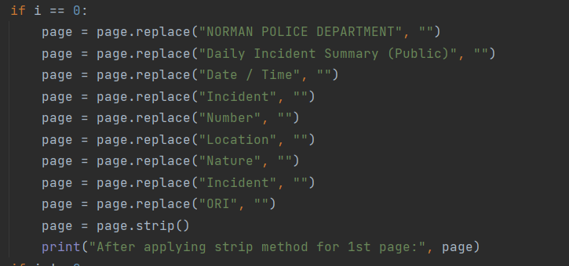
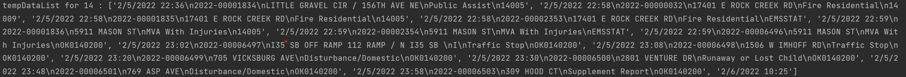
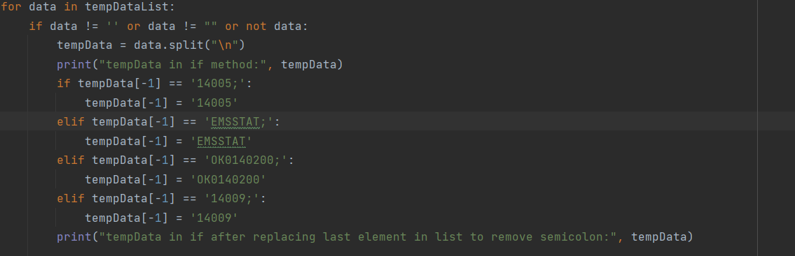

# cs5293sp22-project0
NAME: 
Sai Prakash Davuluri

EXAMPLE ON HOW TO RUN THE APPLICATION: 

pipenv run python project0/main.py --incidents https://www.normanok.gov/sites/default/files/documents/2022-02/2022-02-01_daily_incident_summary.pdf

WEB OR EXTERNAL LIBRARIES:
* import argparse
* import PyPDF2
* import re
* import urllib.request
* import sqlite3

INSTALLATION OF ABOVE LIBRARIES:
* To install PyPDF2: pip install PyPDF2 (if you receive an error like 'module not found' please use this: pipenv install PyPDF2)
* To install re: pip install regex

Note: All the above-mentioned libraries come as in-built modules for python3 but if they are not pre-installed then use the above commands to install them.

FUNCTIONS AND APPROACH TO DEVELOPING THE DATABASE:

main.py:
* This file acts as a base layer for my project where it takes the incidents URL which is of String type as input from the user and passes it to the main function as an input parameter.
* In the main function, we make function calls to three different class files named fetchIncidents.py, extractIncidents.py, and incidentsDB.py which contains methods that collect, extract, insert, and provide incident_nature, respective count to the user.
* At first, the URL which was collected from the user will be passed as an input parameter to the 'fetchincidents' function in the 'dataFetchedFromURL' class in the fetchIncidents.py file. This function returns data as output which will be acted as an input for another function.
* The result from the 'fetchincidents' function act as an input parameter to 'extractincidents' function in 'extractDataFromFile' class file in extractIncidents.py file. After the data is fetched and processed, it will send to 'populatedb' function in 'incidentDataBase' class in incidentsDB.py file to be inserted into the sqlite3 database.
* Before inserting the data, we make a function call to 'createdb' function to see if we can successfully connect to the database.
* Finally, we call the 'status' function in the 'incidentDataBase' class in the incidentsDB.py file to check the incident_nature and its respective count.

fetchIncidents.py:
* In this file, the 'fetchincidents' function receives the user-provided URL as an input and uses the urllib.request library to open the URL and returns the output as file-like objects. This library has urlopen function to perform this operation.
* The final result is returned to the main function and passed as an input to the 'extractincidents' function.

extractIncidents.py
* This file contains a function called 'extractincidents' which takes the result from 'fetchincidents' function.
* Firstly, it writes the data to a temporary file using the "import tempfile" module and sets the seek value to 0. So, python knows to read data from the start of the file.
* Using the' PyPDF2.pdf.PdfFileReader' module, we read the data from tempfile and store it in pdfReader variable which becomes an iterable file-like object.
* I have used for loop to iterate the pdfReader and to extract text in a page based on parameter i. 

* Above if block was written for page 0 to replace String discripencies like 'NORMAN POLICE DEPARTMENT', 'Daily Incident Summary (Public)', 'Date / Time', 'Incident', 'Number', 'Location', 'Nature', and 'Incident ORI' with ''(empty space).
* Further to remove the empty spaces in a string, I have used the strip method.

output:
`Before applying replace method for page: 0
Page value Date / Time
Incident Number
Location
Nature
Incident ORI
2/5/2022 0:07
2022-00006333
520 BLUE FISH RD
Assault
OK0140200
2/5/2022 0:38
2022-00006334
36TH AVE NW / PRARIE CREEK DR
Traffic Stop
OK0140200
2/5/2022 0:46
2022-00002313
EMSSTAT
2/5/2022 0:46
2022-00001797
1501 S ELM AVE
Breathing Problems
14005
2/5/2022 0:54
2022-00006336
N SANTA FE AVE / W MAIN ST
Traffic Stop
OK0140200
2/5/2022 1:02
2022-00006337
283 W SYMMES ST
Traffic Stop
OK0140200
2/5/2022 1:02
2022-00006338
225 INTERSTATE DR
Welfare Check
OK0140200
2/5/2022 1:06
2022-00006339
900 HALRAY DR
Disturbance/Domestic
OK0140200
2/5/2022 1:12
2022-00006340
6620 156TH AVE NE
911 Call Nature Unknown
OK0140200
2/5/2022 1:21
2022-00006341
746 ASP AVE
Contact a Subject
OK0140200
2/5/2022 1:35
2022-00006342
796 ASP AVE
Fight
OK0140200
2/5/2022 1:37
2022-00001798
4501 W ROBINSON ST
Fire Carbon Monoxide Alarm
14005
2/5/2022 1:39
2022-00006343
1906 144TH AVE SE
Disturbance/Domestic
OK0140200
2/5/2022 1:43
2022-00006345
6221 INTERSTATE DR E
Drug Violation
OK0140200
2/5/2022 1:44
2022-00006344
746 ASP AVE
Public Intoxication
OK0140200
2/5/2022 1:48
2022-00006346
650 N INTERSTATE DR W
Alarm
OK0140200
NORMAN POLICE DEPARTMENT
Daily Incident Summary (Public)`

`After applying strip method for page: 0
Page value 2/5/2022 0:07
2022-00006333
520 BLUE FISH RD
Assault
OK0140200
2/5/2022 0:38
2022-00006334
36TH AVE NW / PRARIE CREEK DR
Traffic Stop
OK0140200
2/5/2022 0:46
2022-00002313
EMSSTAT
2/5/2022 0:46
2022-00001797
1501 S ELM AVE
Breathing Problems
14005
2/5/2022 0:54
2022-00006336
N SANTA FE AVE / W MAIN ST
Traffic Stop
OK0140200
2/5/2022 1:02
2022-00006337
283 W SYMMES ST
Traffic Stop
OK0140200
2/5/2022 1:02
2022-00006338
225 INTERSTATE DR
Welfare Check
OK0140200
2/5/2022 1:06
2022-00006339
900 HALRAY DR
Disturbance/Domestic
OK0140200
2/5/2022 1:12
2022-00006340
6620 156TH AVE NE
911 Call  Unknown
OK0140200
2/5/2022 1:21
2022-00006341
746 ASP AVE
Contact a Subject
OK0140200
2/5/2022 1:35
2022-00006342
796 ASP AVE
Fight
OK0140200
2/5/2022 1:37
2022-00001798
4501 W ROBINSON ST
Fire Carbon Monoxide Alarm
14005
2/5/2022 1:39
2022-00006343
1906 144TH AVE SE
Disturbance/Domestic
OK0140200
2/5/2022 1:43
2022-00006345
6221 INTERSTATE DR E
Drug Violation
OK0140200
2/5/2022 1:44
2022-00006344
746 ASP AVE
Public Intoxication
OK0140200
2/5/2022 1:48
2022-00006346
650 N INTERSTATE DR W
Alarm
OK0140200`

* The above if block can be used to remove spaces if any for the remaining pages in the pdf file.

* After the String value in the page is stripped of spaces, I am adding a delimiter to the values in the 5th column in the file to specify that it is the end of the row(To know more about it please refer to the assumptions block).
* After adding a delimiter to the values, it is easy to split the String value(which contains the whole page) into a list using the split() method. So, the output for this code will be in a list format containing String values which are rows on a certain page.
Output: Here, every String value is a row in a pdf file.

* In the below code, the for loop is used to iterate a list that contains multiple rows. Every list value splits again into a sub-list and stored in a tempData variable.

* If you observe the below image and the text which is highlighted, we can observe that when the initial split happened every last row in a list that holds the current page data has a delimiter at the very end. So, to clean the data of these kinds of discrepancies, I have written the if-else block that removes the delimiter.

